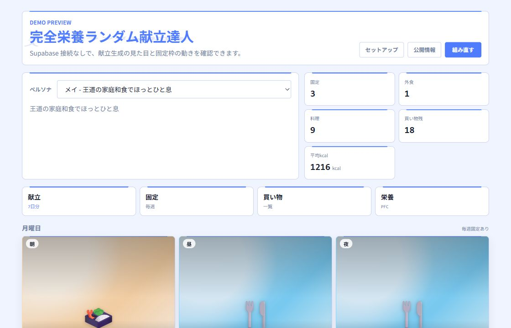
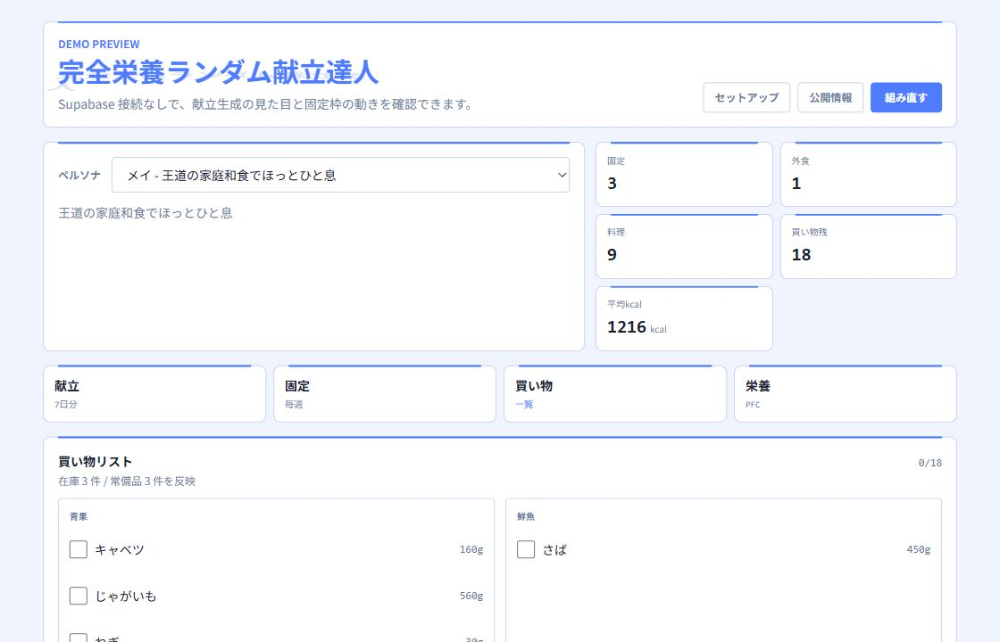
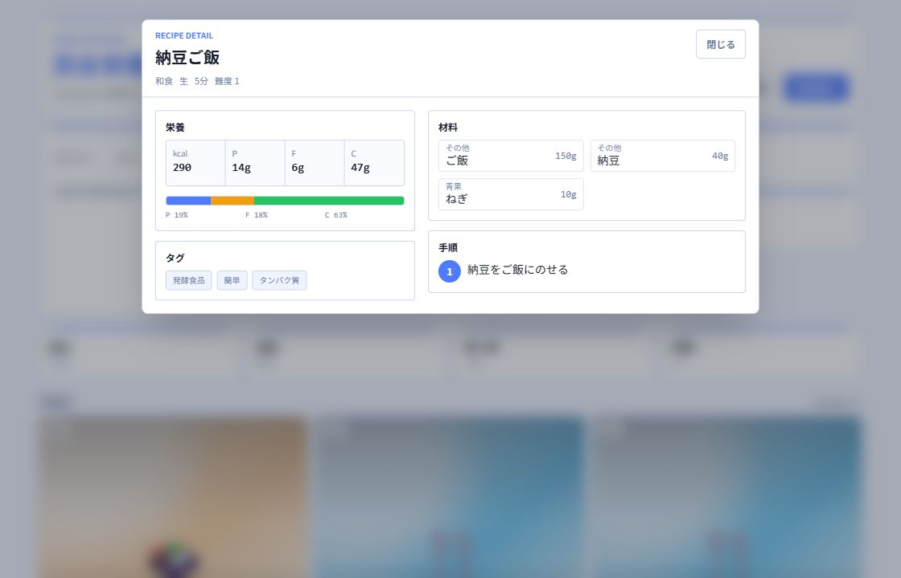
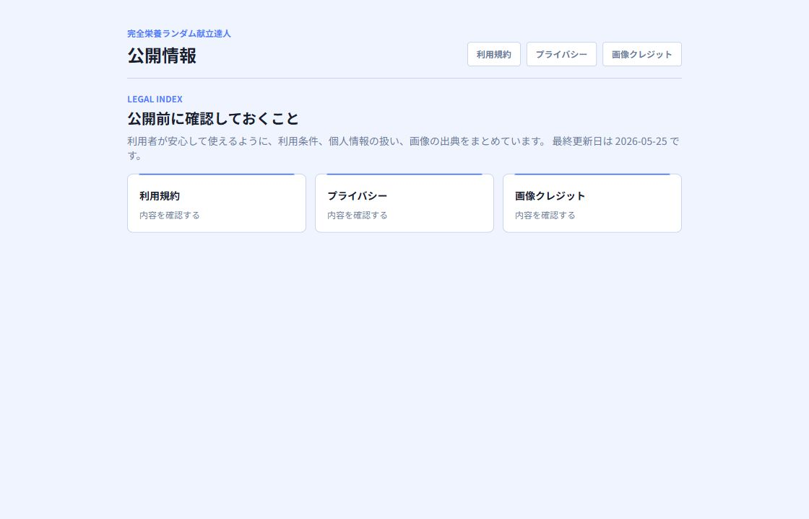

# 完全栄養ランダム献立達人 Portfolio Case Study

## 作品概要

完全栄養ランダム献立達人は、1週間分の献立、在庫、常備品、買い物リスト、固定したい食事枠をまとめて扱う Web アプリです。Web アプリは、ブラウザから使えるアプリのことです。

「毎週の献立を考える時間を減らす」「家にある食材を使い切る」「買い物リストを手で作る手間を減らす」という課題を、Next.js と Supabase で実装しました。Next.js は React ベースの Web framework、Supabase は認証と database（データベース）をまとめて扱うクラウド基盤です。

## 想定ユーザー

- 忙しく、毎週の献立を考える負担を減らしたい人
- 家族や自分の食事を、朝・昼・夜でまとめて管理したい人
- 在庫や常備品を反映した買い物リストを作りたい人
- 栄養バランスやアレルギー注意を意識しながら、実用的な食事計画を作りたい人

## できること

- 7日分の朝・昼・夜の献立を生成
- 毎週固定の食事枠と外食枠を反映
- レシピ詳細、材料、手順、PFC バランスを表示
- 在庫と常備品を差し引いた買い物リストを生成
- Supabase Auth によるログイン・新規登録
- 利用規約、プライバシーポリシー、画像クレジットを公開ページとして表示
- 公開前 E2E と画像出典 strict 検査を実行

PFC は protein / fat / carbohydrate、つまりタンパク質・脂質・炭水化物の比率です。E2E は end-to-end の略で、入口から出口までの動作確認です。strict 検査は、警告も失敗として扱う強めの検査です。

## スクリーンショット

### Dashboard



### Weekly Meal Plan


### Shopping List



### Recipe Detail



### Legal Pages



## 技術構成

| 領域 | 技術 |
|---|---|
| Frontend | Next.js 16 App Router, React 19, TypeScript, Tailwind CSS |
| Backend | Next.js Route Handler, Supabase Auth, Supabase Database |
| Data | Supabase SQL migration, typed database model |
| State / Logic | Zustand, 献立生成、栄養計算、買い物リスト集計 |
| Quality | ESLint, TypeScript, build, public E2E, source notes strict check |
| Deploy | Vercel deploy helper, Supabase production setup guide |

Route Handler は Next.js で API を実装する場所です。migration は database の変更を順番に適用するための SQL 履歴です。deploy は手元のコードを本番環境へ反映することです。

## 技術的な見どころ

### 1. 認証付き画面と公開画面の分離

ログインが必要な dashboard / recipes / shopping などの画面と、誰でも見られる demo / legal / setup を分けています。Supabase session をもとに、未ログイン時の導線を制御します。

### 2. 献立生成ロジック

ペルソナ、固定枠、外食枠、苦手・アレルギー情報を入力として、1週間分の献立を作ります。単なる乱数ではなく、ユーザーの条件を重ねた上で候補を選ぶ構成です。

### 3. 買い物リスト集計

週の献立に含まれる材料を合算し、在庫と常備品を差し引いて、必要な買い物だけを category 別にまとめます。category は「青果」「精肉」などの分類です。

### 4. 公開前検査

`npm run release:check` で、通常検査、画像出典 strict 検査、公開導線 E2E をまとめて実行できます。アプリ本体だけでなく、公開に必要な周辺品質まで確認できるようにしています。

### 5. 画像出典の運用

レシピ画像は URL だけでなく、source notes（出典メモ）として source page URL、author、license、fit を管理します。author / license が placeholder に戻った場合、strict 検査で公開前に止まります。

### 6. ポートフォリオ用 demo deep link

`/demo?section=shopping` や `/demo?recipe=demo-natto-rice` で、買い物リストやレシピ詳細を直接開けます。deep link は、特定の状態へ直接移動できる URL のことです。README や面接資料から見せたい画面へ一直線に案内できます。

## 検査コマンド

```powershell
npm run check
npm run recipe-images:sources-check:strict
npm run e2e:public:run
git diff --check
```

公開前にまとめて確認する場合:

```powershell
npm run release:check
```

## 現在の制約

- 本番公開 URL はまだ未設定です。Vercel token と project id が入れば `npm run deploy:production` で進められます。
- App Store 向け iOS アプリではなく、現時点では Web アプリです。
- 医療・栄養指導アプリではありません。栄養表示は参考情報として扱う前提です。
- demo は Supabase 接続なしで見せるためのサンプル表示です。認証後の実データ画面スクリーンショットは、公開用テストユーザーを作るとさらに強くなります。

## 次に改善すると強い点

1. Vercel へ本番 deploy し、README とこのファイルに公開 URL を追加する。
2. テストユーザーで dashboard / recipes / shopping の実データ画面スクリーンショットを追加する。
3. `ARCHITECTURE.md` を追加し、Supabase schema、RLS、画面遷移、E2E の流れを図解する。
4. 技術記事として「Next.js + Supabase で献立アプリを作った話」を公開する。
5. 画像を実写真または統一された生成画像へ寄せ、視覚的な完成度を上げる。

## 面接・案件提案で話せること

- 認証、database、UI、公開導線をひとつの作品としてまとめたこと
- migration と seed data を使い、再現可能な database 初期化を意識したこと
- E2E と strict 出典検査で、公開前の品質ゲートを作ったこと
- 法務ページと画像クレジットまで用意し、公開運用を意識したこと
- demo deep link とスクリーンショットで、見る人が短時間で価値を理解できるようにしたこと
